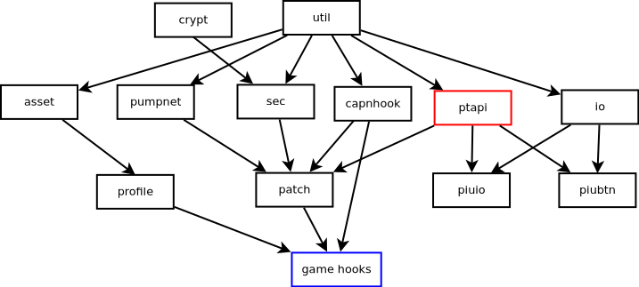

# Architecture
The follow image shows a rough outline of pumptools's architecture based on the project's namespacing. Arrows indicate
architectural dependencies. Modules in red colored boxes expose APIs and blue colored boxes expose application/library
binaries.

## util
The kitchen sink, basically used by everything. Not going to elaborate the details here as it is quite self-explanatory
when taking a look at its modules.

## crypt
Kitchen sink for everything crypto related. Could be with `util` but I somewhat felt the need to have this separated.

## asset
Modules for handling various types of asserts from pump games, e.g. usb profiles.

## pumpnet
Modules to talk to pumpnet for usb profiles over sockets. Used by NX2 to Fiesta 2.

## sec
Contains several sub-modules for security/dongle related topics such as full software emulation.

## capnhook
This is the heart of pumptools to enable hooking of system and library calls. `capnhook` has two sub-modules, `hook`
and `hooklib`. `hook` provides the foundation for hooking various things, typically IO related, such as files,
filesystem, hardware IO (e.g. USB), signal handlers. `hooklib` provides helper modules based on `hook` that take care
of common tasks such as path based redirects, USB device emulation and IO call monitoring.

## ptapi
Pumptools's API package exposing APIs to the end-user. Also contains any libraries and tools used by the APIs.

## io
Contains modules to talk to real IO hardware, e.g. `piuio`, `piubtn`.

## patch
`patch` is a common package for various modules that are shared with multiple pump versions. A patch module takes care
of patching, i.e. hooking and detouring usually, a single aspect like fixing a API quirk, enabling window mode etc.

# game hooks
`game hooks` are composed of multiple `patch` modules making up the final hook library that you preload to the target
application. The structure of each `game hook` is identical and only the patches and hooks applied differ per game
version.
