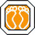

# Pump it Up NX2: Next Xenesis
This document collects various information about the game itself.

## Trivia
* Release: October 2007
* First version to allow storing player scores and unlock state on a usb thumb drive. The original game only allows
special brand of usb thumb drives. Other drives are not accepted by the game. Profiles were managed and uploaded by
the player using a proprietary software called "PUMBI" which is no longer supported.

# Game modes
* Arcade Station: Separated into 3 channels. Each channel contains songs with chart difficulties Normal, Hard, Crazy,
Freestyle, Nightmare
  * New Tunes
  * Banya
  * K-Pop
  * Pop
* Training Station
* Special Station: Full versions, remixes and another step (charts)
* World Max: Clear missions to unlock further locked missions and content in Special Station

## World max guide and unlocks
Either take a look at the `missions.txt` file in the `game` data folder or use [Turkeyslam's guide](guide/nx2.pdf) which
was published on ph-online back in the days. 

### Cancel
Clear all modifiers previously enabled.

### Increase arrow scroll speed
Arrow scroll speed 2x, 3x, 4x or 8x the BPM. The following code must be entered one time for 2x, two times for 3x,
three times for 4x and four times for 8x.

### Decrease arrow scroll speed

### Vanish
The arrows vanish before reaching the target at the top.

### Nonstep
Hide all steps.

### Mirror

### Random Step
Randomizes the step chart.

### Random Velocity
The arrow scroll speed changes randomly during the song.

### Earthworm
Makes the arrows wave back and fourth as they scroll to the top.

### Exceed Mode
Arrows travel diagonally towards the top.

### Freedom
Stationary arrows at the top are invisible.

### Acceleration
Arrows start scrolling slowly at the bottom of the screen and accelerate when scrolling towards the top stationary
arrows.

### Deceleration
Arrows start scrolling fast at the bottom of the screen and decelerate when scrolling towards the top stationary
arrows.

### Under attack
Point mirror the target (grey) area with the center of the screen as the origin. This results in the P1 target area
positioned upside down in bottom right corner and the P2 target area positioned upside down in the bottom left corner.

### Flash
Arrows are disappearing and appearing in short intervals ("flashing") when moving towards the top.

### NX mode
Tilts the perspective of the arrows scrolling towards the targets from an "overhead" perspective to a "distant"
perspective.

### Grade reverse
Shows inverse judgements during game play, i.e. perfect = miss, great = bad

### Extra mix skin

### Canon-D eye skin

### Flower card skin

### Playing card skin

### Random skin

